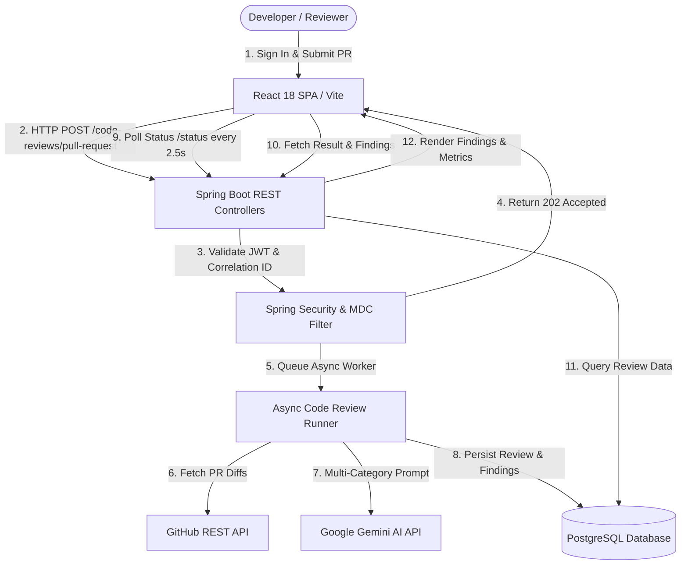

# AI Code Review Bot 🤖

[](https://www.oracle.com/java/)
[](https://spring.io/projects/spring-boot)
[](https://react.dev/)
[](https://vitejs.dev/)
[](https://www.postgresql.org/)
[](https://www.docker.com/)
[](LICENSE)

An enterprise-grade, full-stack automated **AI Code Review Bot** that integrates with **GitHub Pull Requests** and leverages **Google Gemini AI** to execute automated code reviews, flag security vulnerabilities and performance bottlenecks, post inline feedback, and track execution metrics in a modern React dashboard.

---

## 📌 Problem Statement

Code reviews are essential for maintaining software quality, security, and maintainability. However, manual code reviews can introduce bottlenecks in rapid development cycles. Reviewers frequently spend time identifying routine issues such as syntax smells, security anti-patterns, missing error handling, and style violations instead of focusing on high-level architecture.

**AI Code Review Bot** automates initial Pull Request analysis by acting as an autonomous, AI-assisted reviewer that immediately analyzes PR code diffs, generates structured findings, and tracks progress asynchronously without blocking reviewer velocity.

---

## ✨ Key Features

- ⚡ **Automated PR Review Execution**: Asynchronously processes incoming GitHub Pull Requests (HTTP 202 Accepted) using non-blocking worker threads.
- 🧠 **Multi-Category AI Analysis**: Evaluates PR diffs against Google Gemini AI across critical categories: `BUG`, `SECURITY`, `PERFORMANCE`, `CODE_STYLE`, `MAINTAINABILITY`, and `OTHER`.
- 📊 **Interactive React Dashboard**: Real-time review metrics, execution duration tracking, status indicators (`IN_PROGRESS`, `COMPLETED`, `FAILED`), and paginated review history.
- 🔍 **Rich Findings Visualizer & Severity Filter**: Detailed finding cards with exact file paths, line ranges (`Line X` or `Lines X-Y`), code recommendation blocks, and severity filters (`CRITICAL`, `HIGH`, `MEDIUM`, `LOW`, `INFO`).
- 🛡️ **Production Resilience & Fail-Safety**: Implements exponential backoff retries and circuit breaker policies (Resilience4j style) for external GitHub and Gemini API calls.
- 📈 **Production Observability & MDC Tracing**: Integrated Spring Boot Actuator health checks (`/actuator/health` with `/liveness` and `/readiness` probes), Micrometer metrics (`code_review.*`, `github.api.*`, `gemini.api.*`), and `X-Correlation-ID` tracing across async threads.
- 🔑 **Stateless JWT Security**: Role-based access control (`ROLE_USER`, `ROLE_ADMIN`, `ROLE_DEVELOPER`) with BCrypt password encoding.
- 🐳 **Containerized Deployment**: Ready-to-deploy multi-stage Docker builds for backend and frontend orchestrated via Docker Compose.

---

## 📐 Architecture & Technology Stack

### End-to-End Workflow Diagram



### System Component Stack

| Layer | Technology | Key Libraries / Frameworks |
| :--- | :--- | :--- |
| **Frontend** | React 18 (Vite 5) | React Router DOM v6, Axios, Vanilla CSS Tokens |
| **Backend** | Java 21 / Spring Boot 3.2.5 | Spring Security, Spring Data JPA, Actuator, Micrometer |
| **Database** | PostgreSQL 16 / H2 | HikariCP, Hibernate ORM |
| **External APIs**| Google Gemini AI API, GitHub REST API | Google GenAI SDK, JWT (jjwt) |
| **Resilience & Monitoring** | Custom Resilience Engine & Actuator | SLF4J MDC, Prometheus Micrometer Registry |
| **DevOps & Containers** | Docker & Docker Compose | Nginx Alpine, Eclipse Temurin 21 JRE |

---

## 🔒 Authentication & Security

- **JWT Authentication**: Stateless authentication utilizing HMAC-SHA256 signed JSON Web Tokens.
- **Header Interceptor**: Frontend Axios client automatically injects `Authorization: Bearer <token>` into protected requests.
- **Passcode Protection**: BCrypt hashing applied to all user passwords (`PasswordEncoder`).
- **Production Secret Isolation**: Zero hardcoded secrets; credentials populated via environment variables (`JWT_SECRET`, `GITHUB_APP_ID`, `GITHUB_PRIVATE_KEY`, `GEMINI_API_KEY`).

---

## 🔄 Asynchronous Review & Resilience Workflow

1. **Submission**: Client calls `POST /api/v1/code-reviews/pull-request`. The backend validates the request, initializes a `CodeReview` record with status `IN_PROGRESS`, and returns `HTTP 202 Accepted` along with the `codeReviewId`.
2. **Background Execution**: `AsyncCodeReviewRunner` executes the code review asynchronously:
   - Propagates MDC `correlationId` to background threads.
   - Fetches PR context and diffs from GitHub API.
   - Executes multi-prompt AI review with Google Gemini API.
   - Saves generated `CodeReviewFinding` records to PostgreSQL.
3. **Resilience Engine**: External network calls to GitHub and Gemini APIs are wrapped in retry loops with exponential backoff and circuit breaking to gracefully handle temporary rate limits or downstream outages.
4. **Polling & Completion**: React frontend polls `GET /api/v1/code-reviews/{id}/status` every 2.5 seconds. When the status reaches `COMPLETED` or `FAILED`, polling cleanly terminates and full results are fetched via `GET /api/v1/code-reviews/{id}/result`.

---

## 🔌 API Endpoint Reference

### Authentication
- `POST /api/v1/auth/register` - Register a new user account.
- `POST /api/v1/auth/login` - Authenticate and obtain JWT access token.

### Code Reviews
- `POST /api/v1/code-reviews/pull-request` - Trigger asynchronous PR review (`HTTP 202 Accepted`).
- `GET /api/v1/code-reviews` - Retrieve paginated review history (`page`, `size`, `sort`, `status`, `owner`, `repository`, `pullRequestNumber`).
- `GET /api/v1/code-reviews/{id}` - Retrieve review details by ID.
- `GET /api/v1/code-reviews/{id}/status` - Retrieve light-weight review execution status.
- `GET /api/v1/code-reviews/{id}/result` - Retrieve full review execution result and AI summary.
- `GET /api/v1/code-reviews/{id}/findings` - Retrieve paginated findings for a review ID (`page`, `size`, `sort`).

### Production Observability & Health
- `GET /api/v1/actuator/health` - Production health check (includes database, GitHub API, and Gemini AI health indicators).
- `GET /api/v1/actuator/info` - Application information.
- `GET /api/v1/actuator/metrics` - Micrometer application metrics.
- `GET /api/v1/actuator/prometheus` - Prometheus metrics export.

---

## 🚀 Local Quick Start

### Prerequisites
- **JDK 21** or higher
- **Node.js v18+** and npm
- **Maven 3.9+**
- **Docker & Docker Compose** (Optional)

### Running Locally (Development Mode)

1. **Clone Repository**:
   ```bash
   git clone https://github.com/PrajapatiPushkar/AI-Code-Review-Bot.git
   cd AI-Code-Review-Bot
   ```

2. **Start Backend**:
   ```bash
   cd backend
   cp .env.example .env  # Configure your credentials
   mvn spring-boot:run
   ```
   *Backend starts on `http://localhost:8080` (API base: `http://localhost:8080/api/v1`)*.

3. **Start Frontend**:
   ```bash
   cd ../frontend
   cp .env.example .env
   npm install
   npm run dev
   ```
   *Frontend starts on `http://localhost:5173`*.

---

## 🐳 Docker Deployment Guide

To run the entire full-stack application (`PostgreSQL`, `Spring Boot Backend`, `React Frontend`) in Docker containers:

1. **Set Environment Variables**:
   Copy `.env.example` to `.env` in the root directory and populate your keys:
   ```env
   POSTGRES_DB=code_review_bot
   POSTGRES_USER=postgres
   POSTGRES_PASSWORD=postgres
   JWT_SECRET=your_production_jwt_secret_key_at_least_32_bytes_long
   GITHUB_APP_ID=123456
   GITHUB_PRIVATE_KEY=your_github_app_private_key
   GEMINI_API_KEY=your_gemini_api_key
   ```

2. **Build & Launch Containers**:
   ```bash
   docker compose up --build -d
   ```

3. **Verify Deployment**:
   - React Frontend: `http://localhost:5173`
   - Spring Boot Backend API: `http://localhost:8080/api/v1`
   - Health Check: `http://localhost:8080/api/v1/actuator/health`

---

## 🧪 Automated Testing

### Backend Unit & Integration Tests
```bash
cd backend
mvn test "-Dtest=*Test,!AiCodeReviewBotApplicationTests"
```
*Executes 258 unit and integration tests covering security, async execution, controllers, persistence, resilience, metrics, and health indicators.*

### Frontend Production Build Test
```bash
cd frontend
npm run build
```
*Executes Vite production build compilation check.*

---

## 📁 Repository Structure

```text
AI-Code-Review-Bot/
├── backend/
│   ├── src/
│   │   ├── main/java/com/pushkar/codereview/
│   │   │   ├── auth/            # JWT authentication & controller
│   │   │   ├── config/          # Security, Actuator health & CORS config
│   │   │   ├── exception/       # Global REST exception handlers
│   │   │   ├── github/review/   # PR review engine, async runner & findings
│   │   │   ├── resilience/      # Retry engine & failure handling
│   │   │   ├── security/        # JWT filters & UserDetailsService
│   │   │   └── user/            # User entity & management
│   │   └── test/java/           # 258 automated unit & integration tests
│   ├── Dockerfile
│   └── pom.xml
├── frontend/
│   ├── src/
│   │   ├── components/          # Reusable UI components (Navbar, FindingCard, Loading)
│   │   ├── context/             # AuthContext & state management
│   │   ├── hooks/               # Custom hooks (useAuth)
│   │   ├── pages/               # Application pages (Dashboard, Reviews, Findings)
│   │   ├── services/            # Axios API client & services
│   │   ├── App.jsx              # Router layout
│   │   └── index.css            # CSS design system tokens
│   ├── Dockerfile
│   ├── package.json
│   └── vite.config.js
├── docker-compose.yml           # Local multi-container orchestration
├── docker-compose.prod.yml      # Production compose override
├── .gitignore
├── .dockerignore
└── README.md
```

---

## 🔮 Future Improvements

- **Diff Highlighting**: Interactive side-by-side git diff viewer on the findings page.
- **Webhook Subscriptions**: Direct automated GitHub Webhook listener setup for instant push-triggered code reviews.
- **Multi-Model Support**: Support for additional LLM providers (Anthropic Claude, OpenAI GPT-4o) alongside Google Gemini.

---

## 📄 License

This project is licensed under the MIT License - see the [LICENSE](LICENSE) file for details.
