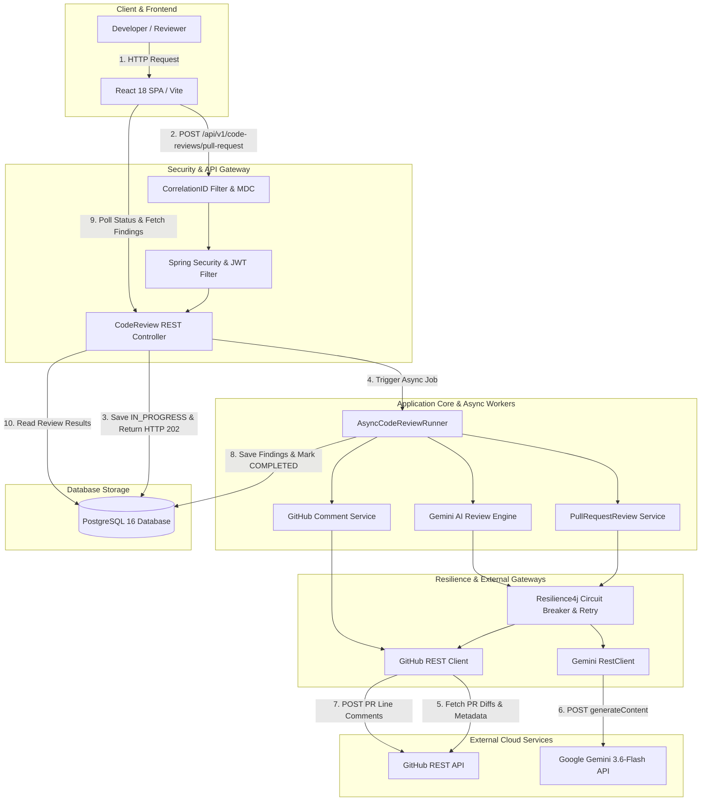
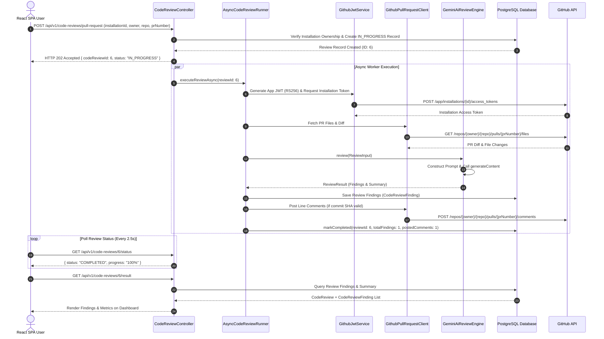
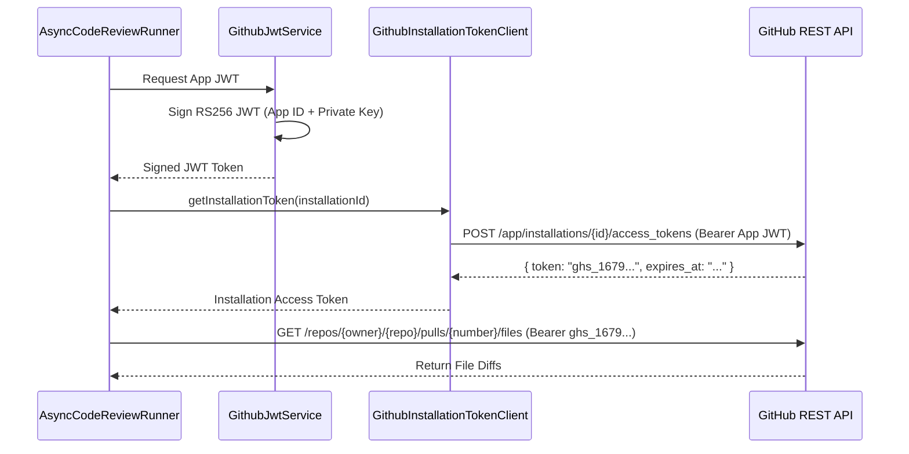
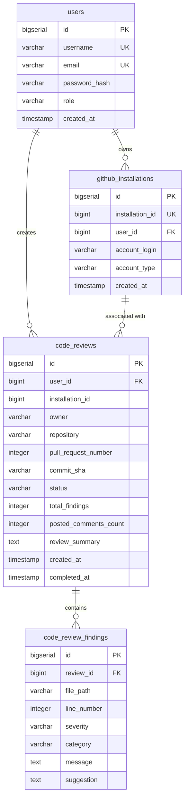
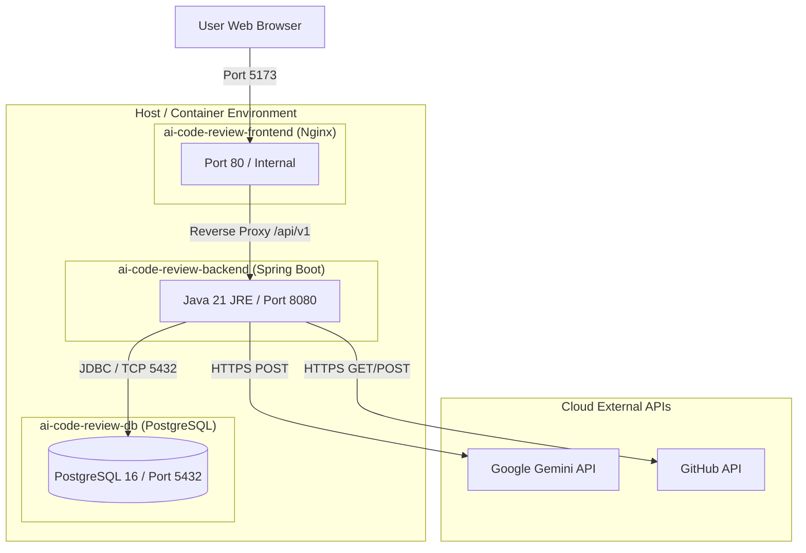

# 🤖 AI Code Review Bot

> An asynchronous, AI-powered GitHub Pull Request review platform built with **Java 21**, **Spring Boot 3.3.2**, **React 18**, **PostgreSQL 16**, **GitHub Apps API**, **Google Gemini 3.6-Flash**, **Docker**, **JWT**, and **Resilience4j**.

---

[](https://www.oracle.com/java/)
[](https://spring.io/projects/spring-boot)
[](https://react.dev/)
[](https://vitejs.dev/)
[](https://www.postgresql.org/)
[](https://deepmind.google/technologies/gemini/)
[](https://docs.github.com/en/apps)
[](https://www.docker.com/)
[]()
[]()

---

## 💡 What Makes This Project Interesting?

Unlike standard AI wrapper apps or simple chatbot widgets, **AI Code Review Bot** is a production-grade, asynchronous developer platform designed to handle real enterprise GitHub workflows:

* **Real GitHub App Authentication**: Generates short-lived **RS256 JWT tokens** using a private key (`.pem`) to request installation access tokens for organization/repo scopes.
* **Asynchronous Review Engine**: Solves HTTP gateway timeouts by accepting requests with **HTTP 202 Accepted** and delegating execution to non-blocking background workers (`AsyncCodeReviewRunner`).
* **Google Gemini 3.6-Flash Reasoning**: Analyzes code diffs for security bugs, performance bottlenecks, syntax anti-patterns, and architectural flaws, outputting structured JSON findings.
* **Inline GitHub Review Posting**: Automatically creates line-level review comments on GitHub PRs using the GitHub Pull Request Comments API.
* **Resilient Infrastructure**: Employs **Resilience4j** circuit breakers, exponential backoff retries, and a 60-second HTTP timeout buffer for external APIs.
* **Production Observability**: Full trace propagation via SLF4J MDC (`X-Correlation-ID`) across asynchronous worker boundaries, Spring Boot Actuator probes (`/liveness`, `/readiness`), and Micrometer metrics.

---

## 📑 Table of Contents

- [1. Project Overview](#1-project-overview)
- [2. Key Features](#2-key-features)
- [3. System Architecture](#3-system-architecture)
- [4. End-to-End Request Flow](#4-end-to-end-request-flow)
- [5. Why Asynchronous Processing?](#5-why-asynchronous-processing)
- [6. GitHub App Integration](#6-github-app-integration)
- [7. Gemini AI Review Pipeline](#7-gemini-ai-review-pipeline)
- [8. Database Architecture](#8-database-architecture)
- [9. Backend Architecture](#9-backend-architecture)
- [10. Frontend Architecture](#10-frontend-architecture)
- [11. Security Architecture](#11-security-architecture)
- [12. Resilience & Failure Handling](#12-resilience--failure-handling)
- [13. Observability](#13-observability)
- [14. Docker & Deployment Architecture](#14-docker--deployment-architecture)
- [15. Configuration Reference](#15-configuration-reference)
- [16. Local Quick Start](#16-local-quick-start)
- [17. REST API Reference](#17-rest-api-reference)
- [18. Real End-to-End Verification](#18-real-end-to-end-verification)
- [19. Automated Testing & Verification](#19-automated-testing--verification)
- [20. Project Structure](#20-project-structure)
- [21. Key Engineering Decisions](#21-key-engineering-decisions)
- [22. Known Limitations](#22-known-limitations)
- [23. Future Roadmap](#23-future-roadmap)
- [24. 💬 Technical Interview Talking Points](#24--technical-interview-talking-points)
- [25. 🎬 2-Minute Interview Demo Script](#25--2-minute-interview-demo-script)
- [26. 📸 Visual Interface Showcase](#26--visual-interface-showcase)
- [27. License](#27-license)

---

## 1. Project Overview

### The Problem
In modern software development, code review is essential for maintaining code health and security. However, human reviewers are frequently overwhelmed by routine code formatting issues, syntax smells, and repetitive anti-patterns. This creates software delivery bottlenecks and delays feature releases.

### The Solution
**AI Code Review Bot** acts as an automated, initial-tier reviewer. It intercepts Pull Requests, extracts raw code diffs, evaluates the changes against Google Gemini AI, stores findings in a relational database, posts inline feedback directly to GitHub PR lines, and reports execution status via a modern React dashboard.

```text
  Developer opens Pull Request
               ↓
    AI Code Review Bot API
               ↓
     Fetch PR Context & Diff
               ↓
     Analyze Code via Gemini AI
               ↓
  Persist Findings to PostgreSQL
               ↓
  Post Inline Feedback to GitHub
               ↓
   Real-Time React Dashboard
```

---

## 2. Key Features

### 💻 Developer Experience
* **Single-Page Application (SPA)**: Built with React 18 and Vite for near-instant interaction and state transitions.
* **Interactive Code Review Trigger**: Dedicated review submission form with automatic owner/repo/PR parameter binding.
* **Paginated Review & Finding History**: Displays review state (`IN_PROGRESS`, `COMPLETED`, `FAILED`), execution duration, total findings count, and posted comments count.

### 🤖 AI Review Engine
* **Google Gemini 3.6-Flash Engine**: Multi-category analysis evaluating `BUG`, `SECURITY`, `PERFORMANCE`, `CODE_STYLE`, `MAINTAINABILITY`, and `OTHER`.
* **Structured Response Extraction**: Custom `GeminiResponseParser` extracts structured JSON objects containing severity levels (`CRITICAL`, `HIGH`, `MEDIUM`, `LOW`, `INFO`), line numbers, suggestions, and explanation text.

### 🐙 GitHub App Integration
* **Asymmetric Key (RS256) Auth**: Signs JWTs using GitHub App private key (`.pem`) to retrieve installation access tokens.
* **Installation Ownership Validation**: Verifies that the requesting user owns the GitHub installation before initiating review jobs (`GithubInstallationVerificationClient`).
* **Inline Review Commenting**: Posts targeted line-level feedback directly onto GitHub PR files using `GithubPullRequestReviewCommentClient`.

### ⚙️ Backend Engineering
* **Stateless JWT Security**: Custom `JwtAuthenticationFilter` with role authorization (`ROLE_USER`, `ROLE_ADMIN`, `ROLE_DEVELOPER`).
* **Asynchronous Worker Thread Pool**: Delegated execution (`@Async("taskExecutor")`) returning immediate `HTTP 202 Accepted` responses.
* **Schema Migration Control**: Database version control managed by **Flyway** (`V1__` to `V9__` SQL migrations).

### 🛡️ Reliability & Resilience
* **Resilience4j Retry Policies**: Retries failed downstream calls to GitHub/Gemini with exponential backoff.
* **Circuit Breaker Protection**: Prevents cascade failures when external services experience high error rates.
* **Fault-Tolerant Comment Delivery**: Exceptions during individual comment posting are logged and tracked without dropping persisted AI review results.

---

## 3. System Architecture



---

## 4. End-to-End Request Flow



---

## 5. Why Asynchronous Processing?

Executing AI code reviews synchronously within a standard HTTP request/response cycle introduces severe architectural problems:
1. **Gateway Timeouts**: Gemini AI analysis and GitHub diff fetching for multi-file PRs can take 10–30 seconds, exceeding standard reverse-proxy timeouts (e.g., Nginx 60s timeout).
2. **Thread Starvation**: Holding web container threads (e.g., Tomcat execution threads) open during external I/O exhausts pool connections under concurrent load.
3. **Failure Isolation**: An unexpected network delay or temporary downstream error shouldn't crash the user's web session.

### The Solution: `@Async("taskExecutor")`
When a user submits a PR review request:
1. The backend persists an initial `CodeReview` entity with status `IN_PROGRESS` and returns `HTTP 202 Accepted` immediately (in ~50ms).
2. The work is offloaded to Spring's background thread pool (`taskExecutor`).
3. `AsyncCodeReviewRunner` coordinates diff retrieval, LLM analysis, DB persistence, and GitHub comment posting.
4. If an exception occurs, the runner catches it, records metrics, and transitions the review status to `FAILED` with a detailed error summary.

---

## 6. GitHub App Integration

Rather than relying on personal access tokens (PATs) bound to individual developer accounts, this platform uses a dedicated **GitHub App**:

* **Short-Lived Access Tokens**: Generates an asymmetric RS256 JWT using the App Private Key (`.pem`), which is exchanged with GitHub for a scoped, 1-hour Installation Access Token.
* **Security Isolation**: Access is restricted strictly to repositories where the App has been explicitly installed.
* **Installation Ownership Check**: `GithubInstallationVerificationClient` queries GitHub's API to ensure the authenticated user has access to the specified `installationId`.



---

## 7. Gemini AI Review Pipeline

The AI review engine uses Google's `gemini-3.6-flash` model via the Generative Language REST API.

```text
  Raw PR Diffs & File Metadata
               ↓
   ReviewPromptBuilder.java (Construct System & User Context)
               ↓
  GeminiAiReviewEngine.java (Execute HTTP POST generateContent)
               ↓
   GeminiResponseParser.java (Parse JSON array of findings)
               ↓
  List<ReviewFinding> (Severity, Line, Message, Suggestion)
```

### Key Components
- **`GeminiProperties.java`**: Strongly-typed configuration holding API key, model (`gemini-3.6-flash`), and base URL (`https://generativelanguage.googleapis.com`).
- **`ReviewPromptBuilder.java`**: Formats the code diff into structured context instructions requiring Gemini to output valid JSON.
- **`GeminiResponseParser.java`**: Cleans markdown code fences (` ```json `) and parses raw model output into type-safe Java DTOs.
- **Read Timeout Buffer**: `RestClientConfig.java` enforces a **60,000ms (60s)** HTTP read timeout for Gemini calls to accommodate large PR diffs.

---

## 8. Database Architecture

The PostgreSQL schema is managed via **Flyway** incremental migrations (`V1__` through `V9__`).



---

## 9. Backend Architecture

The backend is built with **Spring Boot 3.3.2** using clean layered architecture:

```text
backend/src/main/java/com/pushkar/codereview/
├── AiCodeReviewBotApplication.java
├── auth/                         # Authentication REST Endpoints & DTOs
│   ├── AuthController.java
│   └── AuthRegistrationService.java
├── config/                       # Security, RestClient, Cors & Properties
│   ├── CorrelationIdFilter.java
│   ├── GeminiProperties.java
│   ├── RestClientConfig.java
│   └── SecurityConfig.java
├── exception/                    # Global Exception Handler & Custom Errors
│   ├── GlobalExceptionHandler.java
│   └── ResourceNotFoundException.java
├── github/                       # GitHub Integration Subsystem
│   ├── auth/                     # GitHub App JWT & Token Services
│   ├── client/                   # GitHub REST Clients (PRs, Files, Comments)
│   └── review/                   # AI Review Engine & Async Execution
│       ├── AsyncCodeReviewRunner.java
│       ├── GithubPullRequestCodeReviewService.java
│       ├── ai/                   # Gemini Client & Prompt Parsers
│       └── persistence/          # Entities & Repositories
├── resilience/                   # Retry Policies & Circuit Breakers
│   └── ResilienceExecutor.java
├── security/                     # Spring Security JWT Filters
│   ├── JwtAuthenticationFilter.java
│   └── JwtService.java
└── user/                         # User Domain Model & Controller
    ├── User.java
    └── UserRepository.java
```

### Layer Responsibilities

| Layer | Primary Responsibility | Key Classes |
| :--- | :--- | :--- |
| **Controller** | HTTP request validation & API response formatting | `CodeReviewController`, `AuthController` |
| **Service** | Core business logic & workflow orchestration | `GithubPullRequestCodeReviewService` |
| **Async Worker** | Non-blocking background review execution | `AsyncCodeReviewRunner` |
| **AI Engine** | Gemini prompt construction & response parsing | `GeminiAiReviewEngine`, `GeminiResponseParser` |
| **GitHub Clients** | GitHub REST API integration & comment posting | `GithubPullRequestClient`, `GithubReviewCommentService` |
| **Security** | Stateless JWT validation & role enforcement | `SecurityConfig`, `JwtAuthenticationFilter` |
| **Resilience** | Circuit breaking & retry execution | `ResilienceExecutor` |
| **Persistence** | Database entity management & Flyway SQL | `CodeReviewPersistenceService`, `CodeReviewRepository` |

---

## 10. Frontend Architecture

The frontend is a modern **React 18** Single Page Application bundled with **Vite 5**.

```text
frontend/src/
├── components/          # UI Components (Navbar, FindingCard, Loading, ErrorMessage)
├── context/             # React Context for Global Authentication State
├── hooks/               # Custom React Hooks (useAuth)
├── pages/               # Application Views
│   ├── DashboardPage.jsx
│   ├── LoginPage.jsx
│   ├── ReviewsPage.jsx
│   ├── SubmitReviewPage.jsx
│   ├── ReviewDetailsPage.jsx
│   └── ReviewFindingsPage.jsx
├── services/            # Axios HTTP Clients & API Modules
│   ├── api.js           # Base Axios instance with JWT interceptors
│   ├── authService.js   # Login & registration methods
│   └── reviewService.js # Code review submission & polling methods
├── App.jsx              # Routing setup (React Router DOM v6)
└── index.css            # Custom CSS Tokens & Utility Styles
```

---

## 11. Security Architecture

### Stateless JWT Authentication
* Authentication requests (`POST /api/v1/auth/login`) return an HMAC-SHA256 signed JWT token.
* `JwtAuthenticationFilter` intercepts protected requests, validates the signature, and sets the Spring `SecurityContext`.

### Role-Based Access Control (RBAC)
* Protected review endpoints require `ROLE_USER`, `ROLE_ADMIN`, or `ROLE_DEVELOPER`.

### Password Encoding
* User passwords are encrypted using **BCrypt** with salt before storage in PostgreSQL (`PasswordEncoderTest` verified).

### Secret Isolation
* Credentials (`GEMINI_API_KEY`, `JWT_SECRET`, `GITHUB_APP_ID`, `GITHUB_PRIVATE_KEY`) are managed exclusively via environment variables and mounted secret volumes (`./secrets:/app/secrets:ro`).
* `.gitignore` prevents inadvertent commits of `.env` or secret keys.

---

## 12. Resilience & Failure Handling

Downstream calls to external cloud services are wrapped by `ResilienceExecutor`:

```text
  External Service Call (GitHub / Gemini)
               ↓
    Resilience4j Circuit Breaker
               ↓
    Exponential Backoff Retries (Max 3 attempts)
               ↓
   Timeout Protection (60s Gemini Buffer)
               ↓
   On Unrecoverable Error → Graceful Fail-State in DB (FAILED)
```

- **GitHub API Failures**: Retried 3 times with exponential backoff (`500ms` initial, `2.0` multiplier).
- **Gemini Timeout Protection**: 60s HTTP read timeout prevents hanging async threads.
- **Fail-Safe Commenting**: Inline comment posting errors (e.g. out-of-diff lines) record warnings without dropping persisted review findings.

---

## 13. Observability

- **MDC Correlation Tracing**: `CorrelationIdFilter` attaches a unique `X-Correlation-ID` (or custom header value) to SLF4J MDC context, carrying it across thread boundaries into `AsyncCodeReviewRunner`.
- **Spring Boot Actuator**: Exposes health endpoints (`/api/v1/actuator/health`) including custom liveness and readiness probes.
- **Micrometer Metrics**: Tracks total review counts, processing durations, and external API error frequencies.

---

## 14. Docker & Deployment Architecture



### Container Configuration Summary
- **Backend Dockerfile**: Multi-stage build (`maven:3.9.8-eclipse-temurin-21-alpine` -> `eclipse-temurin:21-jre-alpine`). Operates under unprivileged user `appuser:appgroup`.
- **Frontend Dockerfile**: Multi-stage build (`node:20-alpine` -> `nginx:alpine`).
- **Compose Healthchecks**: Backend waits for PostgreSQL `pg_isready` before launching.

---

## 15. Configuration Reference

| Environment Variable | Purpose | Default / Example | Required |
| :--- | :--- | :--- | :--- |
| `SPRING_PROFILES_ACTIVE` | Active Spring profile | `dev` / `prod` | Yes |
| `PORT` | Backend application server port | `8080` | Yes |
| `DB_HOST` | PostgreSQL host address | `localhost` / `postgres` | Yes |
| `DB_PORT` | PostgreSQL port | `5432` | Yes |
| `DB_NAME` | Database name | `code_review_bot` | Yes |
| `DB_USERNAME` | Database user | `postgres` | Yes |
| `DB_PASSWORD` | Database password | `postgres` | Yes |
| `JWT_SECRET` | Secret key for JWT HMAC-SHA256 signing | `[Min 32 Bytes]` | Yes |
| `GITHUB_APP_ID` | GitHub App numeric identifier | `4642046` | Yes |
| `GITHUB_PRIVATE_KEY_PATH` | Path to mounted GitHub RSA `.pem` key | `/app/secrets/github-app-private-key.pem` | Yes |
| `GEMINI_API_KEY` | Google Gemini API Key | `[PROTECTED_KEY]` | Yes |
| `GEMINI_MODEL` | Gemini AI model identifier | `gemini-3.6-flash` | Yes |

---

## 16. Local Quick Start

### Prerequisites
* **Java 21 JDK**
* **Node.js v18+** & npm
* **Maven 3.9+**
* **Docker Desktop**

### Step-by-Step Setup

1. **Clone the Repository**:
   ```bash
   git clone https://github.com/PrajapatiPushkar/AI-Code-Review-Bot.git
   cd AI-Code-Review-Bot
   ```

2. **Configure Environment Variables**:
   Copy `.env.example` to `.env`:
   ```bash
   cp .env.example .env
   ```

3. **Provide Secrets**:
   - Place your GitHub App private key at `./secrets/github-app-private-key.pem`.
   - Update `GEMINI_API_KEY` in `.env`.

4. **Launch Application via Docker Compose**:
   ```bash
   docker compose up -d --build
   ```

5. **Verify Running Containers**:
   ```bash
   docker ps
   ```

6. **Check Service Health**:
   ```bash
   curl http://localhost:8080/api/v1/actuator/health/liveness
   ```

7. **Access Frontend**:
   Open `http://localhost:5173` in your browser.

8. **Register User & Execute Code Review**:
   - Register a new account or log in with dev credentials.
   - Enter target Installation ID, Repository Owner, Repository Name, and PR Number.
   - Click **Submit Review** and watch the async execution complete!

---

## 17. REST API Reference

### Authentication Endpoints

| Method | Endpoint | Description | Auth |
| :--- | :--- | :--- | :--- |
| `POST` | `/api/v1/auth/register` | Register a new user | Public |
| `POST` | `/api/v1/auth/login` | Authenticate & receive JWT token | Public |

### Code Review Endpoints

| Method | Endpoint | Description | Auth |
| :--- | :--- | :--- | :--- |
| `POST` | `/api/v1/code-reviews/pull-request` | Submit asynchronous PR review request (`202 Accepted`) | Bearer JWT |
| `GET` | `/api/v1/code-reviews` | Get paginated review history | Bearer JWT |
| `GET` | `/api/v1/code-reviews/{id}` | Get review metadata by ID | Bearer JWT |
| `GET` | `/api/v1/code-reviews/{id}/status` | Light-weight status check (`IN_PROGRESS`, `COMPLETED`, `FAILED`) | Bearer JWT |
| `GET` | `/api/v1/code-reviews/{id}/result` | Get full review result and summary | Bearer JWT |
| `GET` | `/api/v1/code-reviews/{id}/findings` | Get paginated findings for a review ID | Bearer JWT |

### Health & Observability

| Method | Endpoint | Description | Auth |
| :--- | :--- | :--- | :--- |
| `GET` | `/api/v1/actuator/health` | Comprehensive application health status | Public |
| `GET` | `/api/v1/actuator/health/liveness` | Kubernetes liveness probe | Public |
| `GET` | `/api/v1/actuator/health/readiness` | Kubernetes readiness probe | Public |

---

## 18. Real End-to-End Verification

The complete pipeline has been verified against a live GitHub Pull Request:

* **Target Repository**: `PrajapatiPushkar/fitness-monolith`
* **Pull Request**: `#1`
* **Installation ID**: `154790187`
* **Verified Execution Record (Review ID #6)**:
  - **Status**: **`COMPLETED`**
  - **Total Findings Detected**: **`1`**
  - **Posted Inline GitHub Comments**: **`1`**
  - **AI Analysis Finding**: *Functional bug detected in `ActivityService` where `caloriesBurned` was overwritten with zero for user activities.*

---

## 19. Automated Testing & Verification

- **Backend Unit & Integration Tests**: `260 / 260` Passed (`mvn test`)
- **Frontend Production Build**: Passed (`npm run build` completed in `938ms`)
- **Git Code Format Check**: Passed (`git diff --check` with zero errors)
- **Container Deployment**: Verified with 3 active healthy containers

---

## 20. Project Structure

```text
AI-Code-Review-Bot/
├── backend/
│   ├── src/
│   │   ├── main/
│   │   │   ├── java/com/pushkar/codereview/
│   │   │   │   ├── auth/
│   │   │   │   ├── config/
│   │   │   │   ├── exception/
│   │   │   │   ├── github/
│   │   │   │   ├── resilience/
│   │   │   │   ├── security/
│   │   │   │   └── user/
│   │   │   └── resources/
│   │   │       ├── application.yml
│   │   │       ├── application-prod.yml
│   │   │       └── db/migration/
│   │   └── test/
│   ├── Dockerfile
│   └── pom.xml
├── frontend/
│   ├── src/
│   │   ├── components/
│   │   ├── context/
│   │   ├── hooks/
│   │   ├── pages/
│   │   └── services/
│   ├── Dockerfile
│   ├── nginx.conf
│   ├── package.json
│   └── vite.config.js
├── secrets/
│   └── github-app-private-key.pem (Git-ignored)
├── .env.example
├── .gitignore
├── docker-compose.yml
├── docker-compose.prod.yml
└── README.md
```

---

## 21. Key Engineering Decisions

1. **Spring Boot 3.3.2 & Java 21**: Selected for virtual thread capabilities, modern record types, and enterprise ecosystem stability.
2. **PostgreSQL 16 & Flyway**: Chosen to guarantee relational integrity across code reviews and findings with structured migration versioning.
3. **GitHub App Over Personal Access Tokens**: Provides fine-grained installation scopes, short-lived tokens, and organizational security compliance.
4. **Google Gemini 3.6-Flash**: Delivers low latency reasoning performance for code diff comprehension.
5. **Resilience4j Circuit Breakers**: Prevents cascading failures when external API endpoints throttle requests or experience downtime.

---

## 22. Known Limitations

- **Inline Comment Placement Constraints**: GitHub's PR comment REST API requires line numbers to fall strictly within modified diff hunks. If AI detects an issue in unmodified context lines, comments cannot be posted inline and are captured in the DB/Dashboard summary instead.
- **API Rate Limits**: Large multi-file PR reviews are bounded by Google Gemini API TPM/RPM quotas.

---

## 23. Future Roadmap

### Current Implementation (V1.0)
- [x] Asynchronous code review execution
- [x] Gemini 3.6-Flash AI integration
- [x] GitHub App RS256 token authentication
- [x] Inline GitHub PR comment posting
- [x] React dashboard with polling & findings visualizer
- [x] Docker Compose multi-container deployment

### Potential Future Improvements
- [ ] Webhook listener for automatic PR event triggers (`pull_request.opened`)
- [ ] Multi-LLM support (Claude 3.5 Sonnet, OpenAI GPT-4o fallbacks)
- [ ] Redis / RabbitMQ message queue integration for distributed worker scaling

---

## 24. 💬 Technical Interview Talking Points

### Q1: Why did you choose asynchronous processing for code reviews?
> **Answer**: External LLM inference and GitHub REST API calls introduce significant, variable latency (10–30s). Blocking HTTP worker threads during long I/O operations leads to thread starvation and web gateway timeouts (HTTP 504). By using an asynchronous worker pattern (`@Async`), the server immediately acknowledges the request with `HTTP 202 Accepted` and offloads processing to a dedicated background task, while the frontend polls for completion.

### Q2: How does the GitHub App authentication flow work?
> **Answer**: The application uses asymmetric cryptography (RS256). It signs a short-lived JWT using the GitHub App's private key (`.pem`). This JWT is exchanged with GitHub's `/app/installations/{id}/access_tokens` endpoint to obtain a temporary Installation Access Token scoped specifically to the repositories installed by that organization.

### Q3: How do you handle external service failures (e.g. Gemini 404 or rate limits)?
> **Answer**: We wrap external API integrations with Resilience4j circuit breakers and exponential backoff retry policies. Furthermore, if individual GitHub line comments fail due to diff boundary mismatch (HTTP 422), the error is logged as a warning and comment posting continues, ensuring the core AI review results remain persisted and visible to the user.

---

## 25. 🎬 2-Minute Interview Demo Script

1. **Authentication**: Sign in via the React frontend to obtain a JWT token.
2. **Review Submission**: Navigate to **Submit Review**, enter `PrajapatiPushkar/fitness-monolith`, PR `#1`, and click submit.
3. **Async Acknowledgment**: Show the immediate `HTTP 202 Accepted` response state on the UI.
4. **Status Polling**: Demonstrate status transitioning from `IN_PROGRESS` to `COMPLETED`.
5. **Findings Visualization**: Click into the completed review to showcase the AI finding (bug in `ActivityService`).
6. **GitHub Verification**: Switch to GitHub PR #1 and show the inline review comment posted automatically by the bot!

---

## 26. 📸 Visual Interface Showcase

<!-- Add screenshots here before publishing -->
*Recommended Screenshots:*
1. **Dashboard Page**: Review history table with status badges (`COMPLETED`, `IN_PROGRESS`, `FAILED`).
2. **Submit Review Form**: Repository and Pull Request input interface.
3. **Review Findings View**: Detailed code recommendations and severity tags.
4. **GitHub PR Comment**: Live GitHub PR line comment posted by the Bot.

---

## 27. License

This project is licensed under the MIT License - see the [LICENSE](LICENSE) file for details.
