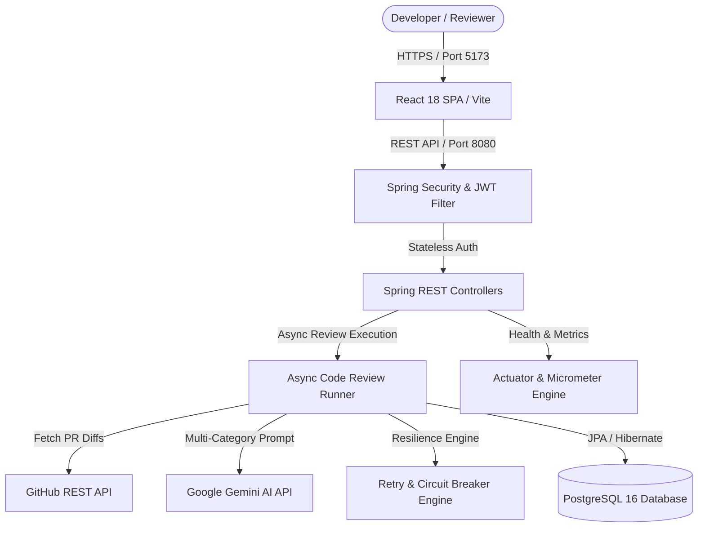
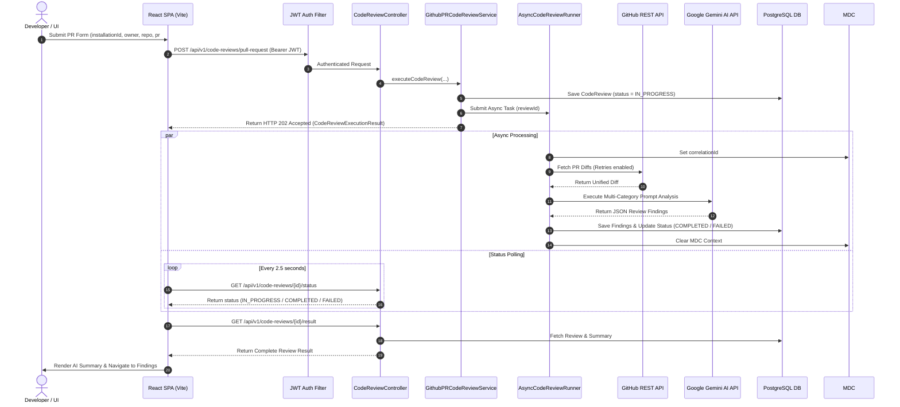
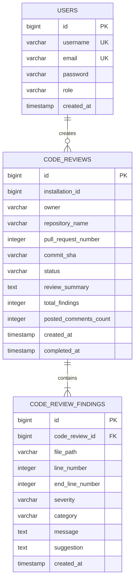
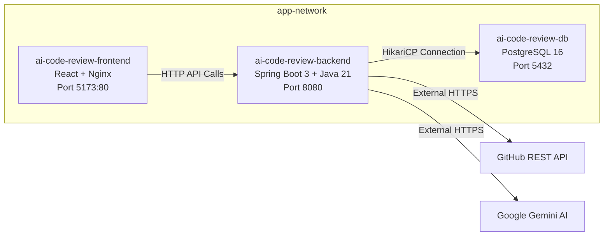

# AI Code Review Bot — System Architecture Document

This document provides a comprehensive technical overview of the system architecture, component design, data flow, authentication model, async execution engine, resilience mechanisms, and deployment infrastructure for the **AI Code Review Bot**.

---

## 1. System Overview

**AI Code Review Bot** is an enterprise-grade full-stack application engineered to automate Pull Request code reviews for GitHub repositories. By integrating Spring Boot 3, React 18, PostgreSQL 16, Google Gemini AI, and GitHub REST APIs, the system automatically analyzes code diffs, generates structured findings across security/performance/bug categories, tracks progress asynchronously, and exposes health and performance metrics via Spring Boot Actuator and Micrometer.



---

## 2. Component Architecture

The backend follows a strict **Layered Clean Architecture**:

```text
com.pushkar.codereview
├── auth/                       # JWT Authentication & Registration API
│   ├── dto/                    # LoginRequest, LoginResponse, RegisterRequest
│   ├── AuthController.java
│   └── AuthService.java
├── config/                     # Security, Actuator Health, & CORS Config
│   ├── health/                 # GithubApiHealthIndicator, GeminiAiHealthIndicator
│   ├── CorrelationIdFilter.java
│   ├── MetricConfig.java
│   └── SecurityConfig.java
├── exception/                  # Global Exception Handling
│   └── GlobalExceptionHandler.java
├── github/                     # GitHub Integration & Review Core
│   └── review/
│       ├── controller/         # CodeReviewController, CodeReviewHistoryController
│       ├── dto/                # Request & Response DTOs
│       ├── persistence/        # CodeReview, CodeReviewFinding Entities & Repositories
│       ├── AsyncCodeReviewRunner.java
│       ├── CodeReviewHistoryService.java
│       └── GithubPullRequestCodeReviewService.java
├── resilience/                 # Fail-Safe Execution & Retries
│   ├── CircuitBreaker.java
│   ├── ResilienceExecutor.java
│   └── RetryPolicy.java
├── security/                   # Spring Security & JWT Token Utilities
│   ├── CurrentUserService.java
│   ├── CustomUserDetailsService.java
│   ├── JwtAuthenticationFilter.java
│   └── JwtService.java
└── user/                       # User Persistence & Management
    ├── dto/
    ├── User.java
    ├── UserRepository.java
    └── UserService.java
```

---

## 3. End-to-End Request & Asynchronous Review Flow

When a user triggers a code review for a GitHub Pull Request:



---

## 4. Authentication Architecture

- **Stateless JWT**: Authentication relies on HMAC-SHA256 signed JSON Web Tokens.
- **Filter Chain**: `JwtAuthenticationFilter` intercepts incoming HTTP requests, parses the `Authorization: Bearer <token>` header, verifies the signature using `JwtService`, loads `UserDetails` via `CustomUserDetailsService`, and sets `SecurityContextHolder`.
- **CORS Compatibility**: `SecurityConfig` allows preflight `OPTIONS` requests and cross-origin requests from `http://localhost:5173`.
- **Exception Handling**: Custom `AuthenticationEntryPoint` (401 Unauthorized) and `AccessDeniedHandler` (403 Forbidden) return structured JSON error responses without leaking internal stack traces.

---

## 5. Persistence & Database Design

### ER Diagram



---

## 6. Resilience & Observability

### Fail-Safe Execution
- **Exponential Backoff Retries**: `ResilienceExecutor` retries external calls to GitHub and Gemini APIs on transient errors (e.g. rate limits, 5xx server errors).
- **Circuit Breaker**: `CircuitBreaker` monitors failure rates. When threshold is exceeded, the circuit opens to prevent downstream system exhaustion.

### Observability & MDC Tracing
- **Spring Boot Actuator**: Exposes production-safe `/actuator/health` (with `/liveness` and `/readiness` probes), `/actuator/info`, `/actuator/metrics`, and `/actuator/prometheus`.
- **Custom Health Indicators**: `GithubApiHealthIndicator` and `GeminiAiHealthIndicator` verify API readiness without leaking credentials.
- **Micrometer Metrics**: Tracks counters and timers for reviews (`code_review.submission.total`, `code_review.duration`), GitHub API calls (`github.api.request`), and Gemini API calls (`gemini.api.request`).
- **MDC Correlation Tracing**: `CorrelationIdFilter` captures/generates `X-Correlation-ID` and injects it into SLF4J MDC, which `AsyncCodeReviewRunner` propagates across asynchronous execution threads.

---

## 7. Containerized Infrastructure



- **Multi-Stage Builds**:
  - Backend: Maven 3.9 build stage → Eclipse Temurin 21 JRE runtime stage under non-root user (`appuser`).
  - Frontend: Node 20 build stage → Nginx Alpine runtime stage.
- **Data Persistence**: Named volume `postgres-data` preserves PostgreSQL database state across container restarts.
- **Production Port Security**: PostgreSQL port `5432` is restricted to internal container network in production (`docker-compose.prod.yml`).
