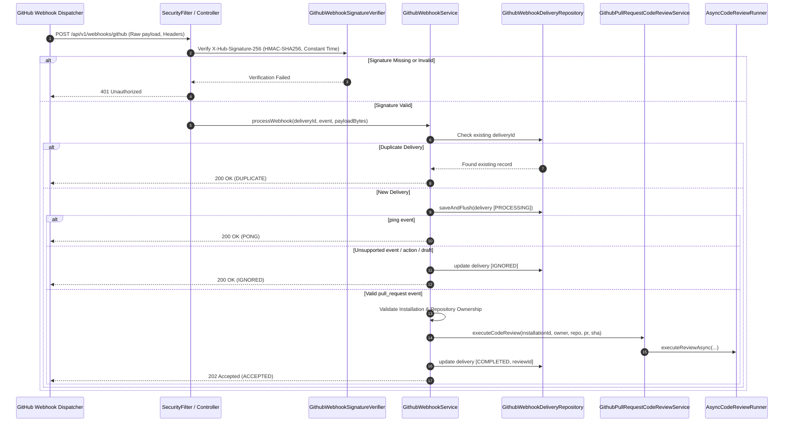

# GitHub Webhook Automation Architecture

This document describes the architectural design, security model, idempotency guarantees, and operational procedures for **Automated GitHub Webhook Code Reviews** in the AI Code Review Bot (Commit 19, V2 Platform).

---

## 1. Overview & Objectives

GitHub Webhook Automation enables the AI Code Review Bot to respond automatically to Pull Request activity. When developers open, update, or reopen a Pull Request on a repository with the GitHub App installed, GitHub emits a signed webhook event. The application verifies the payload authenticity, enforces strict server-side authorization and deduplication, and hands off the review to the existing asynchronous review engine.

---

## 2. Webhook Architecture & Event Flow



---

## 3. Cryptographic Signature Verification

All webhook requests are authenticated using HMAC-SHA256 signatures generated by GitHub with the shared webhook secret.

1. **Header Requirement**: The `X-Hub-Signature-256` header must accompany the request in the format:
   ```
   X-Hub-Signature-256: sha256=<64-char-hex-digest>
   ```
2. **Algorithm**: HMAC using SHA-256 (`HmacSHA256`).
3. **Constant-Time Comparison**: Comparison between computed and received hexadecimal digests uses `java.security.MessageDigest.isEqual(...)` to eliminate timing attack vectors.
4. **Secret Configuration**: The secret is retrieved from `github.webhook-secret` (environment variable `GITHUB_WEBHOOK_SECRET`). If unconfigured or empty, requests are rejected immediately with `401 Unauthorized`.
5. **Body Integrity**: Raw request bytes are consumed before JSON deserialization to guarantee byte-for-byte fidelity with GitHub's signature digest.

---

## 4. Supported Event Types & Actions

### 4.1 Supported Pull Request Actions
Only the following `pull_request` event actions trigger code reviews:
- `opened`: A new Pull Request is created.
- `synchronize`: New commits are pushed to the Pull Request branch.
- `reopened`: A previously closed Pull Request is reopened.
- `ready_for_review`: A draft Pull Request is converted to ready for review.

### 4.2 Ignored Events & Safeguards
- **Ping Event (`ping`)**: GitHub's webhook ping is acknowledged immediately with `200 OK` (`PONG`) to confirm webhook connectivity without executing reviews.
- **Unsupported Events**: Events such as `push`, `issues`, `issue_comment`, `release`, etc., are acknowledged with `200 OK` and recorded as `IGNORED`.
- **Unsupported PR Actions**: Actions such as `closed`, `edited`, `labeled`, `unlabeled`, `assigned`, etc., are safely recorded as `IGNORED`.
- **Draft Pull Requests**: Pull Requests marked with `draft: true` are ignored until transitioned to `ready_for_review`.
- **Closed Pull Requests**: Pull Requests with `state != "open"` are ignored.

---

## 5. Installation & Repository Ownership Validation

To prevent unauthorized, cross-tenant, or unregistered repository code review execution, the webhook service enforces multi-tier ownership validation:

1. **Installation Resolution**:
   - Resolves `GithubInstallation` by `installation.id`.
   - Rejects unverified installations (`installation.isVerified() == false`).
2. **Repository Resolution**:
   - Resolves `Repository` by `githubRepositoryId` or canonical full name (`owner/name`).
   - Verifies the repository is marked active (`isActive == true`).
3. **Tenant Ownership Match**:
   - Verifies that `repository.getUser().getId()` matches `installation.getUser().getId()`.
   - If a repository was transferred or claimed by a different user than the GitHub App installer, the event is rejected with `IGNORED`.
4. **Zero Information Leakage**:
   - Webhook responses for unregistered or mismatched repositories do not disclose sensitive internal account or repository information.

---

## 6. Idempotency & Failure Recovery

GitHub employs at-least-once delivery semantics and may resend webhook payloads upon network blips or timeouts.

### 6.1 Database-Backed Deduplication (`github_webhook_deliveries`)
- Every incoming delivery is tracked by GitHub's unique delivery UUID (`X-GitHub-Delivery`).
- Uniqueness is enforced at the database level with a `UNIQUE (delivery_id)` constraint.

```sql
CREATE TABLE github_webhook_deliveries (
    id BIGSERIAL PRIMARY KEY,
    delivery_id VARCHAR(128) NOT NULL,
    event_type VARCHAR(64) NOT NULL,
    action VARCHAR(64),
    repository VARCHAR(255),
    pull_request_number INT,
    commit_sha VARCHAR(128),
    status VARCHAR(32) NOT NULL DEFAULT 'PROCESSING',
    code_review_id BIGINT,
    error_message VARCHAR(1000),
    received_at TIMESTAMP WITH TIME ZONE NOT NULL DEFAULT CURRENT_TIMESTAMP,
    processed_at TIMESTAMP WITH TIME ZONE,
    CONSTRAINT uk_webhook_deliveries_delivery_id UNIQUE (delivery_id),
    CONSTRAINT fk_webhook_deliveries_code_review FOREIGN KEY (code_review_id)
        REFERENCES code_reviews(id) ON DELETE SET NULL
);
```

### 6.2 Delivery Status Lifecycle
- `PROCESSING`: Delivery registered; validation and dispatch underway.
- `COMPLETED`: Review successfully initiated or linked to existing active review.
- `IGNORED`: Non-actionable event (ping, draft PR, unsupported action, unregistered repo).
- `FAILED`: Dispatch error or unexpected exception occurred during processing.
- `DUPLICATE`: Redelivery detected; existing record returned without re-executing review.

### 6.3 Commit SHA Deduplication
In addition to delivery UUID deduplication, the underlying review pipeline (`GithubPullRequestCodeReviewService`) verifies if an identical review (`repository`, `pullRequestNumber`, `commitSha`) is already `IN_PROGRESS` or `COMPLETED`. If found, the existing review ID is returned and linked to the delivery without launching redundant LLM or rule engine runs.

---

## 7. Required Environment Configuration

Add the following to your local `.env` file (see `.env.example`):

```bash
# GitHub App Webhook Secret (Configured in GitHub App settings -> Webhook secret)
GITHUB_WEBHOOK_SECRET=your_configured_webhook_secret_here
```

In `application.yml`:
```yaml
github:
  webhook-secret: ${GITHUB_WEBHOOK_SECRET:}
```

> [!CAUTION]
> Never commit real webhook secrets to version control. Keep `.env` in `.gitignore`.

---

## 8. GitHub App Setup & Subscriptions

To enable automatic reviews on your GitHub repositories:

1. **GitHub App Settings**:
   - Navigate to **GitHub Developer Settings** $\rightarrow$ **GitHub Apps** $\rightarrow$ Your App.
2. **Webhook URL**:
   - Set **Webhook URL** to `https://<your-domain>/api/v1/webhooks/github` (or `/webhooks/github`).
3. **Webhook Secret**:
   - Generate a strong random secret (e.g. `openssl rand -hex 20`).
   - Enter it in the GitHub App **Webhook secret** field and set it as `GITHUB_WEBHOOK_SECRET` in your environment.
4. **Permissions Required**:
   - **Pull requests**: `Read & write` (to read diffs and post review comments).
   - **Repository contents**: `Read-only` (to inspect file contents for deterministic analysis).
   - **Repository metadata**: `Read-only`.
5. **Event Subscriptions**:
   - Check the **Pull request** event subscription checkbox.

---

## 9. Local Testing & Troubleshooting

### 9.1 Local Testing with Smee.io or ngrok
Because GitHub cannot reach `localhost:8080` directly, use a webhook forwarding proxy for development:

1. **Using Smee.io**:
   ```bash
   npm install --global smee-client
   smee --url https://smee.io/your-unique-channel --target http://localhost:8080/api/v1/webhooks/github
   ```
2. **Set Webhook URL**: In GitHub App settings, set the Webhook URL to your `https://smee.io/your-unique-channel`.

### 9.2 Generating Test Signatures (CLI)
```bash
BODY='{"action":"opened","number":1,"pull_request":{"number":1,"state":"open","draft":false,"head":{"sha":"abc"}},"repository":{"id":123,"name":"demo","full_name":"user/demo","owner":{"login":"user"}},"installation":{"id":456}}'
SECRET="defaultWebhookSecret123"
SIG="sha256=$(echo -n "$BODY" | openssl dgst -sha256 -hmac "$SECRET" | sed 's/^.* //')"

curl -X POST http://localhost:8080/api/v1/webhooks/github \
  -H "Content-Type: application/json" \
  -H "X-Hub-Signature-256: $SIG" \
  -H "X-GitHub-Event: pull_request" \
  -H "X-GitHub-Delivery: $(uuidgen)" \
  -d "$BODY"
```

---

## 10. Known Limitations

- **Branch Matching Policies**: Webhook triggers currently review all branches for active repositories; custom branch include/exclude filters are planned for a future platform iteration.
- **Draft Transition Polling**: PRs opened as drafts are not periodically polled; they are processed when GitHub delivers the `ready_for_review` event.
- **Single Delivery Retry Window**: GitHub redelivers webhooks for up to 24 hours upon 5xx responses; 200/202 responses prevent retry loops on unsupported actions.
