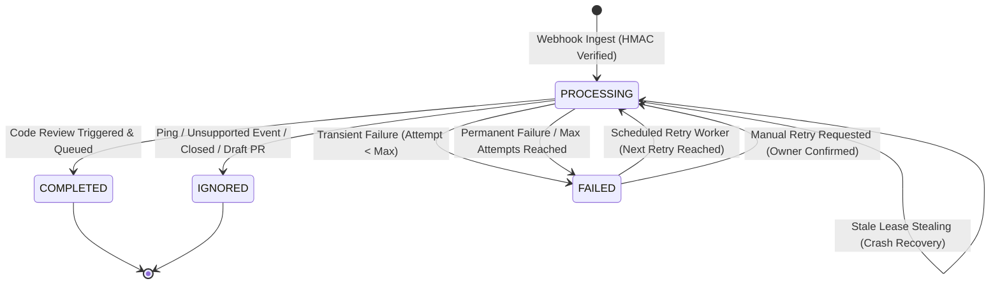

# Webhook Reliability, Retry Management & Operations Dashboard Architecture

This document describes the architectural design, lifecycle state engine, retry and recovery mechanisms, security model, REST operations APIs, and frontend operations dashboard for **Webhook Delivery Reliability** in the AI Code Review Bot (Commit 20, V2 Platform).

---

## 1. Overview & Objectives

In Commit 19, GitHub Webhook Automation was established with HMAC-SHA256 signature verification, basic delivery tracking, and automatic triggering of the asynchronous Pull Request code review engine.

Commit 20 brings the webhook automation subsystem to **production readiness** by delivering:
1. **Granular Delivery Lifecycle Tracking**: Persistent visibility into delivery processing, errors, attempts, and timing metadata.
2. **Safe Transient Retry & Backoff Engine**: Bounded retry scheduling for transient failures while strictly isolating permanent domain/security errors.
3. **Crash Recovery & Lease Stealing**: Detection and recovery of abandoned `PROCESSING` states caused by node termination or unexpected application restarts.
4. **Owner-Scoped Webhook Operations API**: Authenticated endpoints allowing repository owners to monitor delivery history, examine sanitized failure causes, and request manual retries.
5. **Interactive Webhook Operations Dashboard**: A responsive, theme-aware React console providing metric summaries, real-time filtering, detailed modal inspection, and confirmed retries.

---

## 2. Webhook Delivery Lifecycle & State Transitions

The webhook delivery entity (`GithubWebhookDelivery`) maintains an explicit state machine tracking each GitHub event from ingest through terminal resolution:



### Lifecycle States

| Status | Description | Retry Eligibility |
| :--- | :--- | :--- |
| `PROCESSING` | Delivery payload is actively being parsed, validated, or queued to the async review runner. Also used as the acquired lock during retry execution. | Ineligible (unless leased lease has expired past stale threshold) |
| `COMPLETED` | Delivery was valid and successfully generated or linked an asynchronous `CodeReview`. | Ineligible (terminal) |
| `IGNORED` | Valid payload was safely ignored (e.g., `ping` event, unsupported PR action like `closed`, or draft PR). | Ineligible (terminal) |
| `FAILED` | Processing failed due to either a transient condition or a permanent domain/infrastructure error. | Eligible if `retryable == true` and `attemptCount < maxAttempts` (or explicitly retried by owner via API) |

---

## 3. Reliability Metadata & Schema (Flyway V13)

The database schema is migrated via `V13__add_webhook_delivery_reliability_and_retry_fields.sql`:

```sql
ALTER TABLE github_webhook_deliveries
    ADD COLUMN IF NOT EXISTS user_id BIGINT REFERENCES users(id) ON DELETE SET NULL,
    ADD COLUMN IF NOT EXISTS installation_id BIGINT,
    ADD COLUMN IF NOT EXISTS attempt_count INT NOT NULL DEFAULT 1,
    ADD COLUMN IF NOT EXISTS max_attempts INT NOT NULL DEFAULT 3,
    ADD COLUMN IF NOT EXISTS error_category VARCHAR(64),
    ADD COLUMN IF NOT EXISTS started_at TIMESTAMP WITH TIME ZONE,
    ADD COLUMN IF NOT EXISTS next_retry_at TIMESTAMP WITH TIME ZONE,
    ADD COLUMN IF NOT EXISTS retryable BOOLEAN NOT NULL DEFAULT FALSE;

CREATE INDEX IF NOT EXISTS idx_webhook_deliveries_user_status_received 
    ON github_webhook_deliveries(user_id, status, received_at DESC);
CREATE INDEX IF NOT EXISTS idx_webhook_deliveries_retry_lookup 
    ON github_webhook_deliveries(status, retryable, next_retry_at);
CREATE INDEX IF NOT EXISTS idx_webhook_deliveries_stale_lookup 
    ON github_webhook_deliveries(status, started_at);
```

### Key Field Responsibilities

- `user_id`: Identifies the repository owner associated with the webhook delivery, ensuring strict multi-tenant authorization scoping.
- `attempt_count` & `max_attempts`: Track execution cycles to guarantee bounded retries.
- `error_category`: Normalized machine-readable failure categorization (e.g., `TRANSIENT_NETWORK`, `AI_SERVICE_UNAVAILABLE`, `RATE_LIMIT_EXCEEDED`, `UNAUTHORIZED_TENANT`, `MALFORMED_PAYLOAD`).
- `started_at`: UTC timestamp indicating when processing or the current retry attempt began; used for stale lease timeout detection.
- `next_retry_at`: Scheduled UTC timestamp for the next automated retry attempt with exponential backoff.
- `retryable`: Boolean flag distinguishing transient failures from permanent non-retryable rejections.

---

## 4. Retry and Crash Recovery Guarantees

### 4.1 Transient vs. Permanent Error Classification

Failures are categorized at runtime before persisting the delivery status:

1. **Transient (Retryable)**:
   - GitHub API transient HTTP responses (`502 Bad Gateway`, `503 Service Unavailable`, `504 Gateway Timeout`).
   - Rate limiting errors (`429 Too Many Requests`).
   - Network connectivity timeouts, socket disconnects, or temporary database deadlocks.
   - Flagged with `retryable = true`, `nextRetryAt = now() + (initialInterval * multiplier^(attempts - 1))`.

2. **Permanent (Non-Retryable)**:
   - Invalid cryptographic HMAC signatures (`401 Unauthorized`).
   - Malformed JSON payloads or schema validation rejections.
   - Unregistered GitHub installations or active repository not found.
   - Tenant mismatch (the installation owner does not own the linked repository).
   - Flagged with `retryable = false`, `nextRetryAt = null`.

### 4.2 Concurrency Protection & Atomic Lease Claim

To prevent race conditions between scheduled background retry workers, manual user retry clicks, and concurrent application instances:

1. **Atomic SQL Claim**:
   Retries acquire an atomic lease via direct database update:
   ```sql
   UPDATE github_webhook_deliveries
   SET status = 'PROCESSING',
       attempt_count = attempt_count + 1,
       started_at = :now,
       next_retry_at = NULL
   WHERE id = :deliveryId
     AND attempt_count < max_attempts
     AND (status = 'FAILED' OR (status = 'PROCESSING' AND (started_at < :staleThreshold OR (started_at IS NULL AND received_at < :staleThreshold))))
   ```
2. If `rowsAffected == 0`, the claim fails immediately, and the caller receives a rejection (HTTP `400 Bad Request` with an idempotent explanation). No duplicate concurrent worker can execute the same delivery or exceed bounded `max_attempts`.

### 4.3 Stale `PROCESSING` Lease Recovery & Safe Renewal

If an application pod or container crashes while processing a delivery, the delivery is left stranded in `PROCESSING`. 
- Deliveries remaining in `PROCESSING` longer than `webhook.retry.stale-threshold-ms` (default: 5 minutes) are evaluated for recovery.
- **Safe Lease Renewal**: If the review associated with the delivery is still actively running (`IN_PROGRESS`), the delivery lease is automatically renewed (`started_at = now()`) rather than marked failed, guaranteeing that a second worker cannot steal or start duplicate processing while the original worker is active.
- **Completion Sync**: If the associated review already succeeded (`COMPLETED`), the delivery transitions directly to `COMPLETED`.
- **Crash Recovery**: If no active review is running (e.g. process terminated prior to review creation), the delivery transitions to `FAILED` with error category `TIMEOUT` and exponential backoff retry scheduling bounded by `max_attempts`.

### 4.4 Duplicate Review Prevention

Even if GitHub re-sends a delivery or an operator retries a delivery whose async task succeeded:
1. **Delivery ID Deduplication**: The database uniqueness constraint on `delivery_id` prevents duplicate delivery rows.
2. **Review Deduplication**: The webhook runner checks whether an active or completed `CodeReview` already exists for `(repository, pullRequestNumber, headCommitSha)`:
   - If an existing review is found, the delivery links to the existing `reviewId` and marks itself `COMPLETED` immediately without triggering duplicate AI or rule-engine work.

---

## 5. Security & Multi-Tenant Authorization

### 5.1 Public Ingestion vs. Authenticated Operations Separation

- **Public Webhook Ingest Endpoint** (`POST /api/v1/webhooks/github`):
  - Retains `permitAll()` in Spring Security.
  - Authenticated **strictly** via HMAC-SHA256 signature verification (`X-Hub-Signature-256`).
- **Webhook Operations Endpoints** (`/api/v1/webhooks/deliveries/**`):
  - Strictly requires valid JWT authentication (`isAuthenticated()`).
  - Scoped to the authenticated `currentUser`:
    - Regular users can **only** view and retry deliveries where `delivery.user.id == currentUser.id`.
    - Attempts to view or retry deliveries belonging to other users return `404 Not Found` (preventing metadata leakage).
    - `ADMIN` role users possess global oversight across all deliveries.

### 5.2 Secret & Payload Sanitization

- Sensitive data such as webhook secrets, installation tokens, raw authorization headers, and raw JSON payloads are **never** persisted in the database.
- Error messages returned through the operations API and stored in `error_message` are truncated (maximum 500 characters) and sanitized of stack traces and internal secrets.

---

## 6. Webhook Operations REST APIs

All endpoints are prefixed with `/api/v1/webhooks/deliveries` (with backward-compatible alias `/webhooks/deliveries`).

### 6.1 Get Delivery Summary Metrics
- **Endpoint**: `GET /api/v1/webhooks/deliveries/summary`
- **Auth**: Bearer JWT
- **Response**: `200 OK`
```json
{
  "totalDeliveries": 42,
  "completedDeliveries": 35,
  "processingDeliveries": 1,
  "failedDeliveries": 4,
  "ignoredDeliveries": 2
}
```

### 6.2 Paginated Delivery History
- **Endpoint**: `GET /api/v1/webhooks/deliveries`
- **Auth**: Bearer JWT
- **Query Parameters**:
  - `page` (default `0`): 0-indexed page number.
  - `size` (default `20`, max `100`): Page size.
  - `status` (optional): `PROCESSING`, `COMPLETED`, `IGNORED`, `FAILED`.
  - `repository` (optional): Case-insensitive match on repository name.
  - `startDate` / `endDate` (optional): ISO-8601 UTC date bounds.
- **Response**: `200 OK` (Spring `Page<WebhookDeliveryItemResponse>`)

### 6.3 Get Delivery Details
- **Endpoint**: `GET /api/v1/webhooks/deliveries/{deliveryId}`
- **Auth**: Bearer JWT
- **Response**: `200 OK`
```json
{
  "id": 101,
  "deliveryId": "c4d5e6f7-1111-2222-3333-444455556666",
  "eventType": "pull_request",
  "action": "opened",
  "repositoryName": "octocat/hello-world",
  "pullRequestNumber": 42,
  "headCommitSha": "a1b2c3d4e5f6...",
  "status": "FAILED",
  "attemptCount": 2,
  "maxAttempts": 3,
  "errorCategory": "TRANSIENT_NETWORK",
  "errorMessage": "GitHub API timeout during diff retrieval",
  "retryable": true,
  "reviewId": null,
  "receivedAt": "2026-10-10T08:00:00Z",
  "startedAt": "2026-10-10T08:00:01Z",
  "completedAt": null,
  "nextRetryAt": "2026-10-10T08:02:01Z",
  "canRetry": true
}
```

### 6.4 Request Delivery Retry
- **Endpoint**: `POST /api/v1/webhooks/deliveries/{deliveryId}/retry`
- **Auth**: Bearer JWT
- **Response**: `202 Accepted`
```json
{
  "deliveryId": "c4d5e6f7-1111-2222-3333-444455556666",
  "status": "PROCESSING",
  "attemptCount": 3,
  "message": "Delivery retry accepted and scheduled for processing"
}
```
*Note: Returns `400 Bad Request` if the delivery is completed, ignored, currently active without lease expiration, or permanently non-retryable.*

---

## 7. Webhook Operations Dashboard (Frontend)

The Webhook Operations Dashboard is located at `/webhooks` and integrated into the primary application navigation sidebar.

### 7.1 Dashboard Features

1. **KPI Metric Cards**: Real-time cards for Total, Completed, Processing, Failed, and Ignored deliveries with quick-filter interaction on click.
2. **Filtering & Search**:
   - Status selector (`ALL`, `PROCESSING`, `COMPLETED`, `FAILED`, `IGNORED`).
   - Full repository search filter.
   - Clean reset filter action.
3. **Delivery History Table**:
   - Monospace delivery ID badge.
   - Repository tag with linked PR number pill.
   - Event and action pill (e.g., `pull_request:opened`).
   - Live pulse badge for `PROCESSING` records.
   - Attempt counter badge (`attempt / max`).
   - Associated review link directly navigating to `/reviews/{id}`.
4. **Interactive Modals**:
   - **Delivery Detail Modal**: Full breakdown of metadata, UTC timestamps, head commit SHA, and sanitized error diagnostic box.
   - **Retry Confirmation Modal**: Safety warnings, target delivery summary, and double-confirmation before triggering retries.
5. **Empty & Error States**:
   - Informative empty state with step-by-step GitHub App webhook setup instructions when no deliveries exist.
   - Graceful loading skeletons and toast notifications for retry actions.
   - Full support for both Dark and Light themes using CSS design tokens.

---

## 8. Configuration Reference

The following properties configure webhook reliability in `application.yml`:

```yaml
webhook:
  retry:
    max-attempts: ${WEBHOOK_RETRY_MAX_ATTEMPTS:3}
    initial-interval-ms: ${WEBHOOK_RETRY_INITIAL_INTERVAL_MS:60000}
    multiplier: ${WEBHOOK_RETRY_MULTIPLIER:2.0}
    stale-threshold-ms: ${WEBHOOK_RETRY_STALE_THRESHOLD_MS:300000}
    scheduler:
      enabled: ${WEBHOOK_RETRY_SCHEDULER_ENABLED:false}
      fixed-delay-ms: ${WEBHOOK_RETRY_SCHEDULER_FIXED_DELAY_MS:60000}
```

| Environment Variable | Default | Purpose |
| :--- | :--- | :--- |
| `WEBHOOK_RETRY_MAX_ATTEMPTS` | `3` | Maximum processing attempts before permanent failure |
| `WEBHOOK_RETRY_INITIAL_INTERVAL_MS` | `60000` (1 min) | Initial backoff delay before first retry |
| `WEBHOOK_RETRY_MULTIPLIER` | `2.0` | Exponential backoff multiplier |
| `WEBHOOK_RETRY_STALE_THRESHOLD_MS` | `300000` (5 min) | Duration after which a `PROCESSING` record is deemed abandoned |
| `WEBHOOK_RETRY_SCHEDULER_ENABLED` | `false` | Enable automated periodic background retry worker |
| `WEBHOOK_RETRY_SCHEDULER_FIXED_DELAY_MS` | `60000` | Frequency of scheduled retry background execution |

---

## 9. Monitoring & Troubleshooting

### Diagnostic Log Patterns

- **Successful Webhook Processing**:
  ```
  INFO c.p.c.g.w.GithubWebhookService : Successfully dispatched webhook code review: deliveryId=..., reviewId=123
  ```
- **Transient Failure Logged**:
  ```
  WARN c.p.c.g.w.GithubWebhookService : Webhook delivery processing failed (transient): deliveryId=..., attempt=1/3, nextRetry=...
  ```
- **Permanent Failure Logged**:
  ```
  ERROR c.p.c.g.w.GithubWebhookService : Webhook delivery processing failed permanently: deliveryId=..., reason=UNAUTHORIZED_TENANT
  ```
- **Stale Lease Claim**:
  ```
  INFO c.p.c.g.w.GithubWebhookService : Claimed stale processing delivery for recovery: deliveryId=..., startedAt=...
  ```

---

## 10. Known Limitations & Future Enhancements

1. **Payload Size Constraints**: Raw webhook payloads are bounded by standard HTTP request size limits; exceptionally large commit bursts rely on GitHub API commit-fetching rather than the initial webhook body.
2. **Distributed Locking**: Atomic SQL queries handle concurrency safely across multiple instances with low-to-medium throughput. High-scale distributed environments with hundreds of webhook nodes could optionally leverage Redis distributed redlocks.
3. **Automated Scheduler Default**: The scheduled retry daemon is disabled (`enabled: false`) by default in development and test environments to ensure deterministic behavior, relying on operator-driven manual retries unless explicitly activated in clustered deployments.
